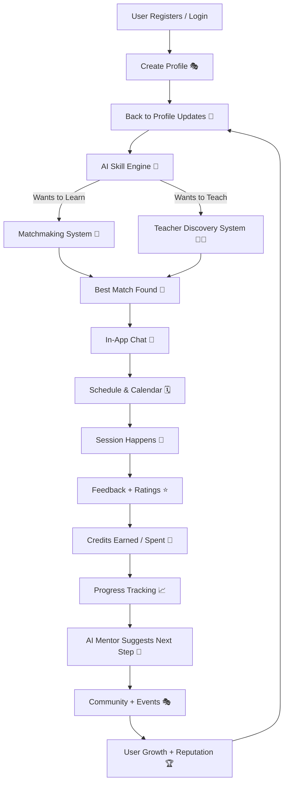

# 🐝 HobbyHive

### 🔥 The World’s Most Powerful **Peer-to-Peer Skill & Hobby Exchange Platform**

HobbyHive is not just an app — it’s a **global movement** where humans exchange knowledge without money barriers.  
If you play guitar and want to learn cooking, and someone cooks like a chef but wants to learn guitar…  
**HobbyHive connects you both — instantly. For free. Forever.**

🌍 Learn anything.  
💛 Teach what you love.  
🤝 Build meaningful human connections.  
🚀 Powered with AI. Designed for the next billion learners.

---

## ✨ Vision
To create the **largest global learning network**, where skills flow freely between people like energy in a hive — collaborative, powerful, unstoppable.

---

## 🎯 Mission
Democratize learning.  
Eliminate the “I wish I could learn” barrier.  
Replace money → with **community**, **collaboration**, and **human exchange**.

---

# 🌟 Key Features

## 🔗 Skill Exchange Engine
- ✔️ Learn any skill  
- ✔️ Teach any skill  
- ✔️ One-to-one exchange model  
- ✔️ Credits-based learning system  
- ✔️ 100% Free forever  

---

## 🤖 AI Powered Smart Matching
HobbyHive is brainy.  
It understands your:

- Skills  
- Hobbies  
- Learning goals  
- Available time  
- Location preference (Online / Offline)  

Then it finds the **perfect match** 🤝  
Smart. Fast. Meaningful.

---

## 🧠 AI Learning Mentor
Get your personal AI coach:

- Personalized learning roadmap  
- Practice tasks  
- Weekly progress reports  
- Motivation tracking  
- Improvement analytics  

---

## 👥 Hyper-Trust Community System
Because trust matters.

- Profile verification  
- Skill badges  
- Experience levels  
- Ratings & Reviews  
- Community reputation system  

Safer. Stronger. Trusted.

---

## 🗓️ Seamless Scheduling & Communication
No chaos. No confusion.

- In-app chat  
- Available time slots  
- Calendar sync  
- Reminder notifications  

Just smooth collaboration.

---

## 🎭 Interest Communities & Clubs
Join communities like:

- 🎸 Music Club  
- 🍳 Cooking Hive  
- 🎨 Art & Creativity  
- 💻 Coding Circle  
- 📚 Language World  
- 🥁 Instrument Lab  
- 🏋 Gym & Fitness Hive  

Make friends. Share passions. Grow together.

---

## 🎉 Events & Workshops
- Free community workshops  
- Online learning rooms  
- Local meetups  
- Skill tournaments  
- Hackathons  
- Creative challenges  

Learning becomes fun again 🎈

---

## 🏆 Gamification — Learn Like a Legend
- XP Points  
- Level System  
- Learning streaks  
- Achievement badges  
- Mastery ranks  
- Leaderboards  

Stay addicted to improving your life.

---

## 🛡️ Safety First
- Secure authentication  
- Verified users  
- Report & block system  
- AI content safety  
- Transparent community rules  

Your safety matters.

---

# 💎 HobbyHive Plus
HobbyHive remains **free forever** 💛  
Premium exists only to enhance experience — NOT to restrict learning.

### **Premium Benefits**
- ⭐ Priority Matching  
- ⭐ Profile Boost  
- ⭐ Advanced AI Mentor  
- ⭐ Early Event Access  
- ⭐ Exclusive Premium Badges  
- ⭐ Extra Credits  

No force. Only choice.

---

# 🧬 System Architecture

---

# 🏗️ MVP Core Components
- Authentication  
- Skill management  
- AI Recommendation System  
- Matching Engine  
- Messaging System  
- Credits System  
- Profile Reputation  
- Scheduling System  

---

# 🚀 Roadmap

### Phase 1 — MVP Launch
- ✔️ Core platform  
- ✔️ Matching + Credits  
- ✔️ Profiles  
- ✔️ Messaging  
- ✔️ Communities  

### Phase 2 — AI Superpower
- ✔️ AI Mentor  
- ✔️ AI Matching Upgrade  
- ✔️ Smart learning roadmap  

### Phase 3 — Expansion
- ✔️ Global scaling  
- ✔️ Live events  
- ✔️ Partnerships  
- ✔️ HobbyHive Plus  

---

# 🌍 Impact
HobbyHive will…

- Empower students  
- Help creators grow  
- Build community culture  
- Make learning free worldwide  
- Replace loneliness with meaningful connections  
- Turn hobbies into skills  
- Turn strangers into friends  
- Turn world into one giant classroom  

---

# 🧑‍💻 Tech Stack
- **Frontend:** React / Next.js / Flutter  
- **Backend:** Node.js / Django / FastAPI  
- **Database:** PostgreSQL + Redis  
- **AI:** OpenAI / Gemini / Local LLM + Recommendation ML  
- **Auth:** Firebase / JWT  
- **Hosting:** AWS / Vercel  
- **Notifications:** Firebase Cloud Messaging  
- **Payments (premium only):** Stripe / Razorpay  

---

# 🤝 Contribute
We welcome:

- Developers  
- Designers  
- Product Thinkers  
- Educators  
- Students  
- Dreamers  
- Doers  

> If you believe in free education…  
> You belong to HobbyHive 💛

---

# ⭐ Support The Vision
If you love this idea:

- Star ⭐ this repo  
- Share it  
- Contribute  
- Join the Hive 🐝  

---

# 🐝 HobbyHive

### **Learn. Teach. Connect. Evolve.**

